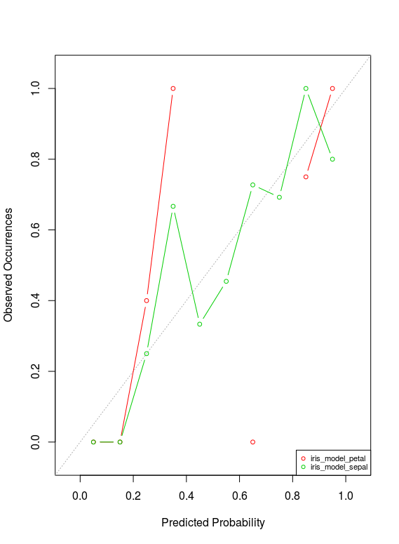
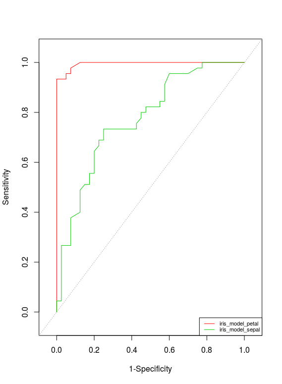

# logitmp
R-package that contains a function for logistic model performance (logitmp)

## Installation
devtools::install_github("sachserf/logitmp")

## Use Case
Compare performance measures of multiple logistic regression models (class: 'glm'). It is also possible to use a single model as input.

## Example Output
*See the helpfile to recompute the following example for the iris dataset.*

```
> logitmp(list(iris_model_petal, iris_model_sepal), color = TRUE, abbreviations = FALSE)
________________________________________________________________________________
 CONTINGENCY TABLE 
                         iris_model_petal iris_model_sepal
predicted and actual -                 38               26
predicted + but actual -                2               14
predicted - but actual +                3               12
predicted and actual +                 42               33
sample number                          85               85
________________________________________________________________________________
 CONTINGENCY TABLE (percentual) 
                         iris_model_petal iris_model_sepal
predicted and actual -               44.7               31
predicted + but actual -              2.4               16
predicted - but actual +              3.5               14
predicted and actual +               49.4               39
________________________________________________________________________________
 MEASURES FOR CLASSIFICATION QUALITY 
                        iris_model_petal iris_model_sepal
degrees of freedom                 2.000            2.000
prevalence                         0.529            0.529
null deviance                    117.541          117.541
residual deviance                 17.783           96.617
difference in deviance           -99.758          -20.924
AIC                               23.783          102.617
overdispersion factor              0.217            1.178
odds ratio                       266.000            5.107
misclassification rate             0.059            0.306
tcr (accuracy)                     0.941            0.694
tpr (sensitivity)                  0.933            0.733
tnr (specifity)                    0.950            0.650
tpa (precision)                    0.955            0.702
tna (inverse precision)            0.927            0.684
fpr (fallout)                      0.050            0.350
fnr (miss rate)                    0.067            0.267
dice (F-measure)                   0.944            0.717
jaccard                            0.894            0.559
Informedness (TSS)                 0.883            0.383
Markedness                         0.881            0.386
Hoslem p-value                     0.996            0.249
NMI                                0.321            0.890
kappa                              0.882            0.384
Nagelkerke R²                      0.922            0.291
AUC                                0.995            0.774
________________________________________________________________________________
 NOTE: For further information choose option "annotations = TRUE" 
```





## References
Crawley, Michael J. 2007. The R Book. Chichester, England; Hoboken, N.J.: Wiley.

Fielding, Alan H., and John F. Bell. 1997. “A Review of Methods for the Assessment of Prediction Errors in Conservation Presence/absence Models.” Environmental Conservation 24 (01): 38–49.

Powers, David Martin. 2011. “Evaluation: From Precision, Recall and F-Measure to ROC, Informedness, Markedness and Correlation.” Journal of Machine Learning Technologies 2 (1): 37–63.

Allouche, Omri, Asaf Tsoar, and Ronen Kadmon. 2006. “Assessing the Accuracy of Species Distribution Models: Prevalence, Kappa and the True Skill Statistic (TSS).” Journal of Applied Ecology 43 (6): 1223–32.

Subhash R. Lele, Jonah L. Keim and Peter Solymos (2014). ResourceSelection: Resource Selection (Probability) Functions for Use-Availability Data. R package version 0.2-4.

Minato Nakazawa (2014). fmsb: Functions for medical statistics book with some demographic data. R package version 0.4.4.

Xavier Robin, Natacha Turck, Alexandre Hainard, Natalia Tiberti, Frédérique Lisacek, Jean-Charles Sanchez and Markus Müller (2011). pROC: an open-source package for R and S+ to analyze and compare ROC curves. BMC Bioinformatics, 12, p. 77


